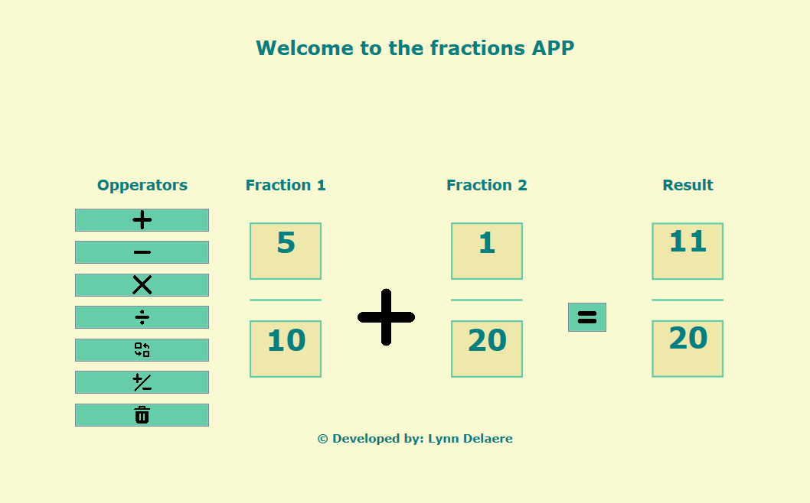
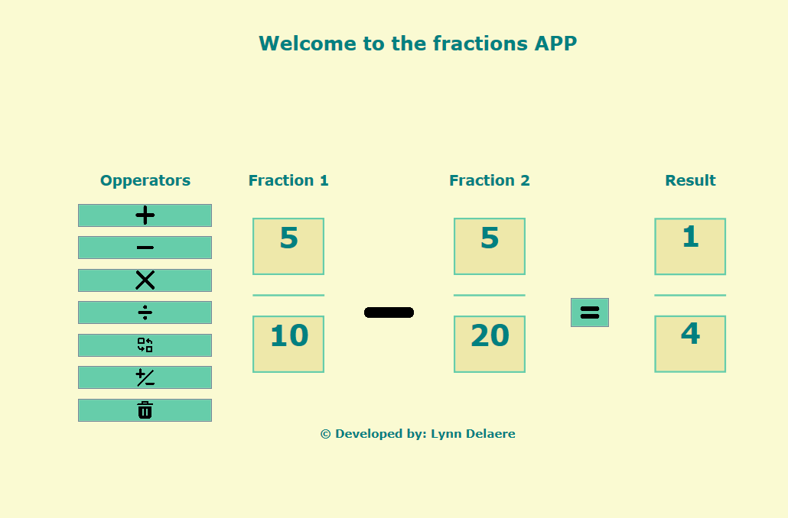
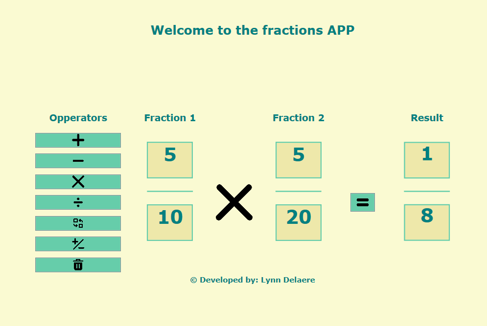
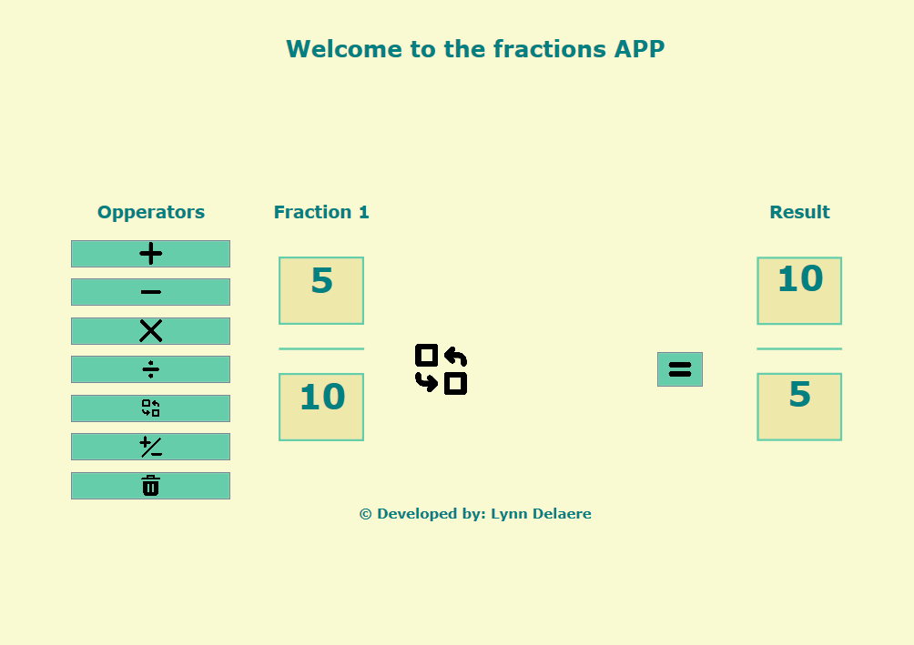
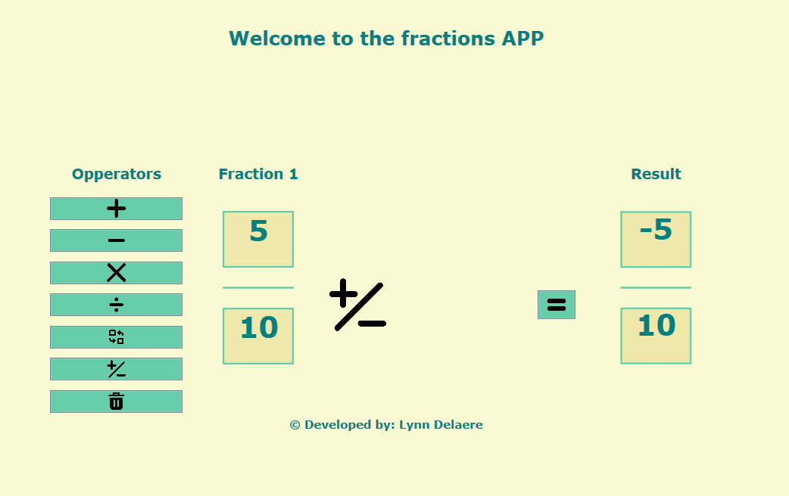
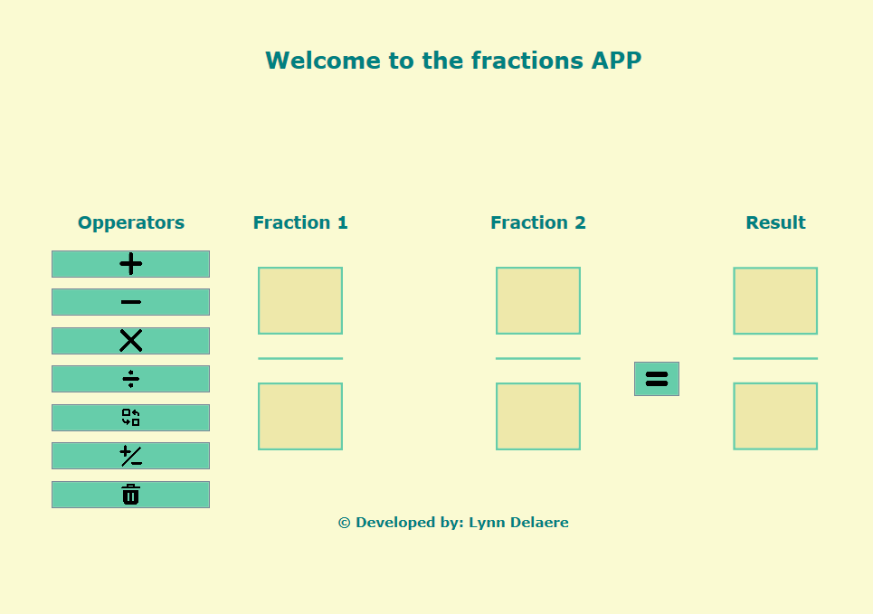
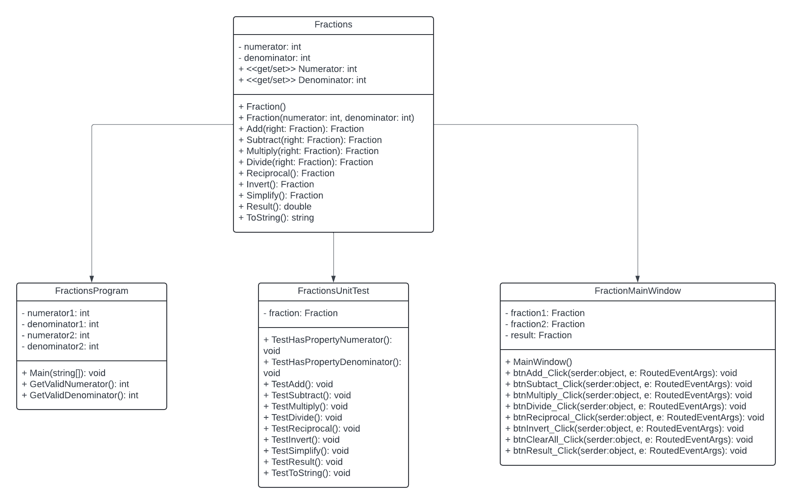

# Fractions App

## Author

This application has been developed by Lynn Delaere, a student enrolled in the Electronics- ICT course at VIVES University Of Applied Sciences, Bruges.

## Project description

In the entire solution, you'll discover four distinct components: a console application titled "FractionsConsoleApp," a library named "FractionsLibrary," a unit test suite labeled "FractionsUnitTest," and a WPF (Windows Presentation Foundation) application designated "FractionsWPFApp."

### FractionsConsoleApp

The console application utilizes the custom library called "FractionsLibrary" to function as a fraction calculator. The application asks the user to input the numerator and denominator of two fractions, which are validated to ensure the input is a valid integer and that the denominators are not zero.

Upon valid inputs, the application creates two fraction objects based on the user's input.

The application then performs arithmetic operations on the two fractions such as addition, subtraction, multiplication, and division on these fractions. Additionally, it computes the reciprocal, where the numerator and denominator are swapped, and the invert of the first fraction. The application also provides a floating-point approximation of the two fractions.

The application ensures input validity by employing two methods that continuously prompt the user for input until valid values are provided, preventing the program from crashing due to invalid input.

### FractionsLibrary

In this library, the class 'Fraction' is provided. The class represents fractions and provides methods for arithmetic operations such as addition, subtraction, multiplication, and division on fractions.

The class encapsulates the numerator and denominator as private attributes and provides methods to access and manipulate them. The property methods allow controlled access to the private attributes. The denominator setter ensures it's never zero by throwing an exception.

The class includes constructors for creating Fraction objects with default values or specified numerator and denominator values. Methods like Add, Subtract, Multiply, and Divide perform arithmetic operations between fractions. Each method takes another Fraction object as input and returns a new Fraction object representing the result.

The Reciprocal method returns a new Fraction object where the numerator and denominator are swapped. If the numerator has a negative value, the sign is swapped from the numerator to the denominator in the result. This is done to enhance readability and clarity. The Invert method is designed to return a fraction with the opposite sign. It creates a new Fraction object where the signs of the numerator and denominator are inverted.

The method simplify finds the greatest common divisor of the numerator and denominator and reduces the fraction to its lowest terms. The result method converts the fraction to a double-precision floating-point number.

The ToString method overrides the default behavior and provides a human-readable string representation of the fraction. It considers special cases like whole numbers (denominator of 1) and zero.

### FractionsUnitTest

The UnitTest1 class contains a series of unit tests for the Fraction class, ensuring that the methods within the Fraction class perform as expected and return correct results in various scenarios.

The tests ensure that the Fraction class has properties called Numerator and Denominator, and that the Denominator cannot be set to zero. The arithmetic tests verify the correctness of arithmetic operations such as addition, subtraction, multiplication, and division. These tests include positive, negative, and zero values.

Tests validate the functionality of the Reciprocal and Invert methods. The Simplify method is tested with large fractions to ensure that the result of the fraction is reduced to its simplest form.

The Result method is tested to ensure that the returned value is the floating-point approximation of a fraction. Tests also validate the correctness of the string representation returned by the ToString method.

To run these unit tests, you need to execute the test class using a testing framework like xUnit. Further information is provided in the section Setup and Usage.

### FractionsWPFApp

The code in FractionsWPFApp defines a WPF (Windows Presentation Foundation) application that utilizes a GUI (Graphical User Interface) framework. The MainWindow.xaml file contains the eXtensible Application Markup Language (XAML) where the layout for the application is declared. Meanwhile, the MainWindow.xaml.cs file contains the event handlers that respond to user actions, such as clicking a button.

The application interface displays two fractions with input boxes corresponding to the numerator and denominator, along with a result fraction and buttons to select the desired operation. When an operation button is clicked, the appropriate image representing the operation is displayed between the two fractions. The second fraction disappears when the reciprocal or invert button is clicked and reappears when another operation is selected, dynamically updating the user interface. All content can be cleared by selecting the clear button.

Upon clicking the "Result" button, the application validates the input fractions, checks the selected operation, performs the corresponding arithmetic operation using the Fraction class methods, and displays the result in the result fraction box. Error handling is implemented to catch exceptions such as division by zero or invalid input, displaying error messages in a message box.

## Screenshots

This section presents a pair of screenshots showcasing the operational WPF application.

## Setup and Usage

To effectively run the solution and conduct unit tests, certain applications and tools are required. The application is developed using Microsoft Visual Studio, specifically tailored for C# development. Therefore, it's essential to install Visual Studio to facilitate the development environment. You can follow this [link](https://from-bace-to-ace.netlify.app/00-visual-studio-community/) for a step-by-step guide on installing Visual Studio Community edition.

Once installed open the project solution called 'FractionsApp.sln' in Visual Studio and build the solution to ensure all dependencies are resolved. Right-click on 'FractionsConsoleApp' and go to 'Configure Startup Projects'. Select single startup project to run the Console Application or the Windows Application, or select multiple startup projects to start both the Console Application and the Windows Application.

To run the xUnit Test right-click on the 'FractionsUnitTest' and run the tests.

## UML Class Diagram

This section displays the UML class diagram of the entire 'FractionsApp.sln' application.

## Future Improvements

- Enhance user interface design and interactivity in the WPF application.
- Include additional mathematical functions for fractions, such as exponentiation and logarithms.
